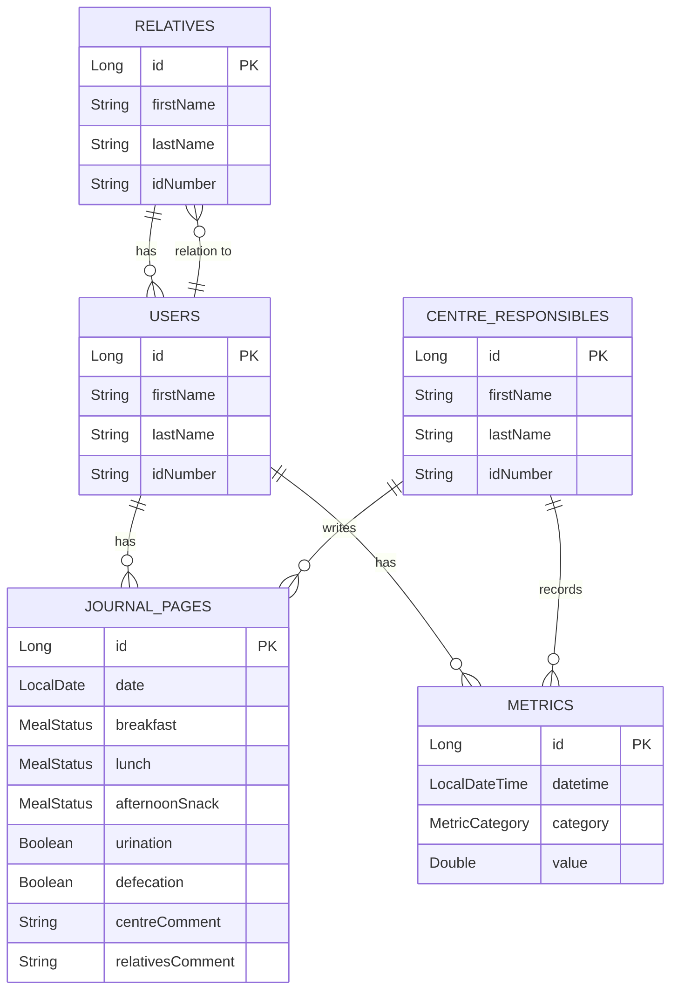

# Centro de día API

## Descripción
API para manejar la información de los usuarios de un centro de día de personas mayores.

Maneja cinco entidades con sus relaciones.

Hay tres entidades que representan las personas del sistema, que son:
los usuarios del centro de día, sus familiares y los responsables del
centro.

Las otras dos entidades son para el manejo de dos piezas de
información de los usuarios del centro:
- Páginas de su diario, con información de cómo han desayunado,
  comido y merendado, y de si han hecho sus necesidades.
- Métricas, que incluyen peso y altura y que permiten múltiples registros
  en distintas fechas para ver la evolución de la persona.

## Entidades

| Entidad | Campos principales | Relaciones |
|---|---|---|
| User | `firstName`, `lastName`, `idNumber` | ManyToMany con `Relative` |
| Relative | `firstName`, `lastName`, `idNumber` | ManyToMany con `User` |
| CentreResponsible | `firstName`, `lastName`, `idNumber` | |
| JournalPage | `date`, `breakfast`, `lunch`, `afternoonSnack`, `urination`, `defecation`, `centreComment`, `relativesComment` | ManyToOne con `User`, ManyToOne con `CentreResponsible` |
| Metric | `dateTime`, `metricCategory`, `value` | ManyToOne con `User`, ManyToOne con `CentreResponsible` |



## Endpoints de la API

| Verbo | URL | Descripción |
|---|---|---|
| **Users** | | |
| GET | `/api/users` | Listar todos los usuarios |
| GET | `/api/users/{id}` | Obtener un usuario por su ID |
| GET | `/api/users/idnumber/{idNumber}` | Obtener un usuario por su DNI/NIE |
| GET | `/api/users/name` | Buscar usuarios por nombre y apellido |
| GET | `/api/users/relative/{id}` | Listar usuarios asociados a un familiar |
| POST | `/api/users` | Crear un nuevo usuario |
| PUT | `/api/users/{id}` | Actualizar un usuario existente |
| DELETE | `/api/users/{id}` | Eliminar un usuario |
| **Relatives** | | |
| GET | `/api/relatives` | Listar todos los familiares |
| GET | `/api/relatives/{id}` | Obtener un familiar por su ID |
| GET | `/api/relatives/idnumber/{idNumber}` | Obtener un familiar por su DNI/NIE |
| GET | `/api/relatives/name` | Buscar familiares por nombre y apellido |
| GET | `/api/relatives/user/{id}` | Listar familiares asociados a un usuario |
| POST | `/api/relatives` | Crear un nuevo familiar |
| PUT | `/api/relatives/{id}` | Actualizar un familiar existente |
| DELETE | `/api/relatives/{id}` | Eliminar un familiar |
| **Centre Responsibles** | | |
| GET | `/api/responsibles` | Listar todos los responsables |
| GET | `/api/responsibles/{id}` | Obtener un responsable por su ID |
| GET | `/api/responsibles/idnumber/{idNumber}` | Obtener un responsable por su DNI/NIE |
| GET | `/api/responsibles/name` | Buscar responsables por nombre y apellido |
| POST | `/api/responsibles` | Crear un nuevo responsable |
| PUT | `/api/responsibles/{id}` | Actualizar un responsable existente |
| DELETE | `/api/responsibles/{id}` | Eliminar un responsable |
| **Journal Pages** | | |
| GET | `/api/journal-pages` | Listar todas las páginas del diario |
| GET | `/api/journal-pages/{id}` | Obtener una página del diario por su ID |
| GET | `/api/journal-pages/user/{id}` | Listar páginas del diario de un usuario |
| GET | `/api/journal-pages/date` | Buscar páginas del diario por fecha |
| POST | `/api/journal-pages` | Crear una nueva página del diario |
| PUT | `/api/journal-pages/{id}` | Actualizar una página del diario |
| DELETE | `/api/journal-pages/{id}` | Eliminar una página del diario |
| **Metrics** | | |
| GET | `/api/metrics` | Listar todas las métricas |
| GET | `/api/metrics/{id}` | Obtener una métrica por su ID |
| GET | `/api/metrics/user/{id}` | Listar métricas de un usuario |
| GET | `/api/metrics/date` | Buscar métricas por fecha y hora |
| GET | `/api/metrics/category/{category}` | Listar métricas por categoría |
| POST | `/api/metrics` | Crear una nueva métrica |
| PUT | `/api/metrics/{id}` | Actualizar una métrica |
| DELETE | `/api/metrics/{id}` | Eliminar una métrica |

## Como ejecutar

```bash
# Con Docker
docker compose up -d

# Sin Docker (H2)
mvn spring-boot:run
```
