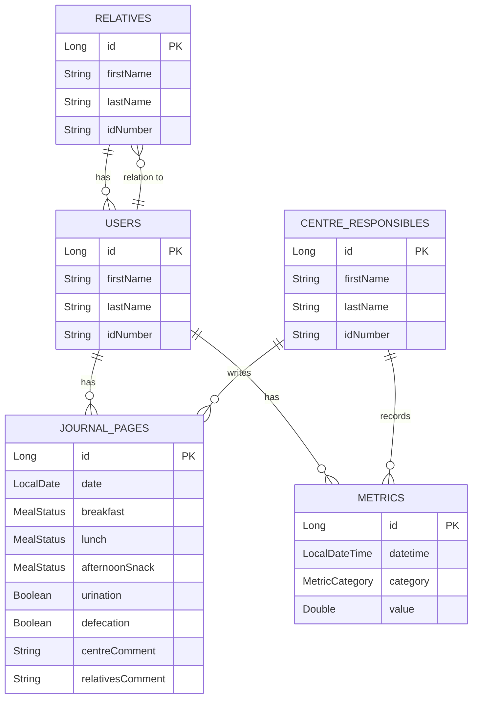

# Centro de día API

## Description
API to manage information about users of a senior day center.

It handles five entities with their relationships.

There are three entities representing the people in the system:
the day center users, their relatives, and the center responsibles.

The other two entities handle two pieces of information about the center users:
- Journal pages, containing information on how they had breakfast, lunch, and afternoon snack, and whether they have performed their physiological needs.
- Metrics, including weight and height, allowing multiple records on different dates to track the person's evolution.

## Entities

| Entity | Main Fields | Relationships |
|---|---|---|
| User | `firstName`, `lastName`, `idNumber` | ManyToMany with `Relative` |
| Relative | `firstName`, `lastName`, `idNumber` | ManyToMany with `User` |
| CentreResponsible | `firstName`, `lastName`, `idNumber` | |
| JournalPage | `date`, `breakfast`, `lunch`, `afternoonSnack`, `urination`, `defecation`, `centreComment`, `relativesComment` | ManyToOne with `User`, ManyToOne with `CentreResponsible` |
| Metric | `dateTime`, `metricCategory`, `value` | ManyToOne with `User`, ManyToOne with `CentreResponsible` |



## API Endpoints

| Verb | URL | Description |
|---|---|---|
| **Users** | | |
| GET | `/api/users` | List all users |
| GET | `/api/users/{id}` | Get a user by their ID |
| GET | `/api/users/idnumber/{idNumber}` | Get a user by their ID number |
| GET | `/api/users/name` | Search users by first and last name |
| GET | `/api/users/relative/{id}` | List users associated with a relative |
| POST | `/api/users` | Create a new user |
| PUT | `/api/users/{id}` | Update an existing user |
| DELETE | `/api/users/{id}` | Delete a user |
| **Relatives** | | |
| GET | `/api/relatives` | List all relatives |
| GET | `/api/relatives/{id}` | Get a relative by their ID |
| GET | `/api/relatives/idnumber/{idNumber}` | Get a relative by their ID number |
| GET | `/api/relatives/name` | Search relatives by first and last name |
| GET | `/api/relatives/user/{id}` | List relatives associated with a user |
| POST | `/api/relatives` | Create a new relative |
| PUT | `/api/relatives/{id}` | Update an existing relative |
| DELETE | `/api/relatives/{id}` | Delete a relative |
| **Centre Responsibles** | | |
| GET | `/api/responsibles` | List all responsibles |
| GET | `/api/responsibles/{id}` | Get a responsible by their ID |
| GET | `/api/responsibles/idnumber/{idNumber}` | Get a responsible by their ID number |
| GET | `/api/responsibles/name` | Search responsibles by first and last name |
| POST | `/api/responsibles` | Create a new responsible |
| PUT | `/api/responsibles/{id}` | Update an existing responsible |
| DELETE | `/api/responsibles/{id}` | Delete a responsible |
| **Journal Pages** | | |
| GET | `/api/journal-pages` | List all journal pages |
| GET | `/api/journal-pages/{id}` | Get a journal page by its ID |
| GET | `/api/journal-pages/user/{id}` | List journal pages for a user |
| GET | `/api/journal-pages/date` | Search journal pages by date |
| POST | `/api/journal-pages` | Create a new journal page |
| PUT | `/api/journal-pages/{id}` | Update a journal page |
| DELETE | `/api/journal-pages/{id}` | Delete a journal page |
| **Metrics** | | |
| GET | `/api/metrics` | List all metrics |
| GET | `/api/metrics/{id}` | Get a metric by its ID |
| GET | `/api/metrics/user/{id}` | List metrics for a user |
| GET | `/api/metrics/date` | Search metrics by date and time |
| GET | `/api/metrics/category/{category}` | List metrics by category |
| POST | `/api/metrics` | Create a new metric |
| PUT | `/api/metrics/{id}` | Update a metric |
| DELETE | `/api/metrics/{id}` | Delete a metric |

## How to run

```bash
# With Docker
docker compose up -d

# Without Docker (H2)
mvn spring-boot:run
```
